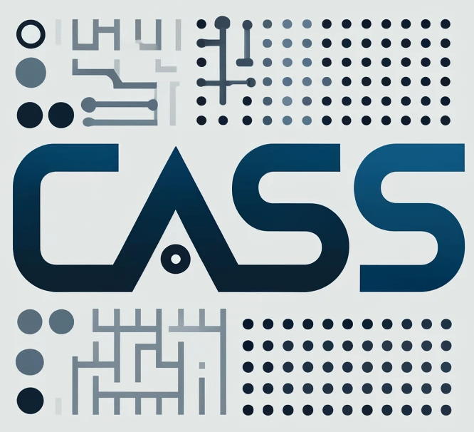

    

## 2024 CASS Community BOF Days
### June 11-13, 2024

We are pleased to announce the **2024 CASS Community Birds-of-a-Feather (BOF) Days**, led by the newly established _Consortium for the Advancement of Scientific Software (CASS)_ and hosted by the PESO (Partnering for Scientific Software Ecosystem Stewardship) project.  This event builds on the tradition of ECP Community BOF Days, which were hosted by the DOE Exascale Computing Project (ECP) during 2021–2023. 

**When:** June 11-13, 2024

**What:** CASS Community BOF Days allow the high-performance computing community to engage with scientific software teams to discuss their latest development efforts.  Each of the 2024 BOF sessions on a given topic will last from 60 to 90 minutes and include a brief overview and a Q&A. We will use Zoom to conduct the BOFs.

**June 11, 2024**
| Time | Topic | Sign up | Details |
|---------|-------|---------|-------------|
| 11:00 am| Exploring the Landscape of AI and ML in Compiler Development: Pros and Cons  | [Register]() | [Details](bofs2024/compiler.md) |
| 11:00 am| Foundations Forum | [Register]() | |
|  1:00 pm| CASS | [Register]() | |
| 3:00 pm| SUNDIALS| [Register]() | |
| 3:00 pm| I/O Challenges & SciDAC| [Register]() | |

**Session Topics:**
- Differentiable and Portable Programming for Science
- Kokkos EcoSystem - State of the Union
- Near-term challenges and opportunities for I/O
- ParaView and Catalyst
- MPICH: A High-Performance Open Source MPI Library for Leadership-class HPC Systems
- Exploring the Landscape of AI and ML in Compiler Development: Pros and Cons
- Foundations Forum (facilitated by CORSA)
- Building an Inclusive and Productive Community from Many Organizations to Support Software Stewardship
- Better Scientific Software Fellowship Community
- SUNDIALS User Experiences
- Introducing CASS: Consortium for the Advancement of Scientific Software

**Sign up:** Sessions will be finalized soon.  Come back to this page to sign up for them.
